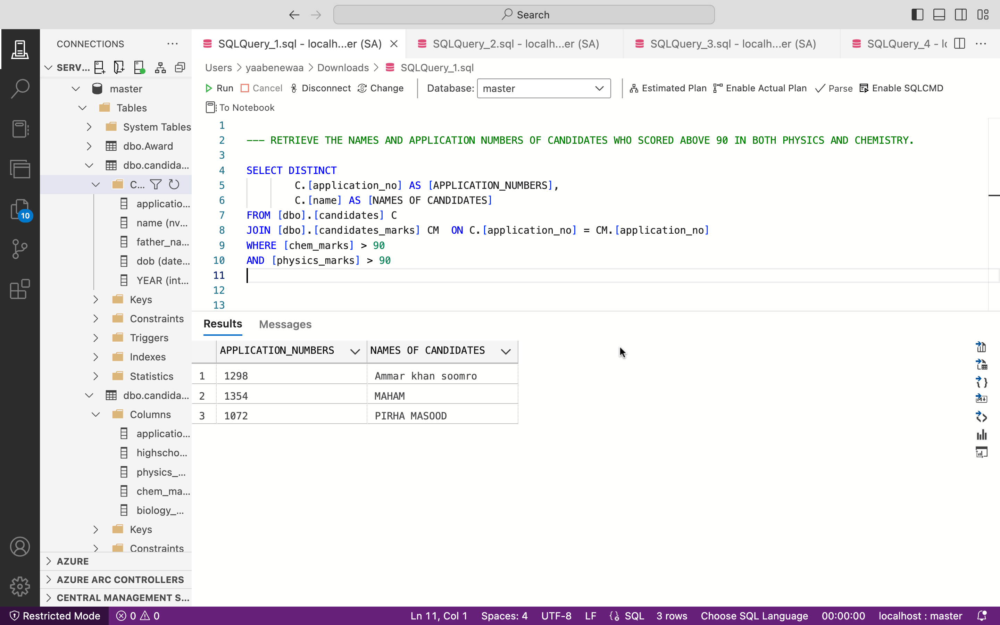
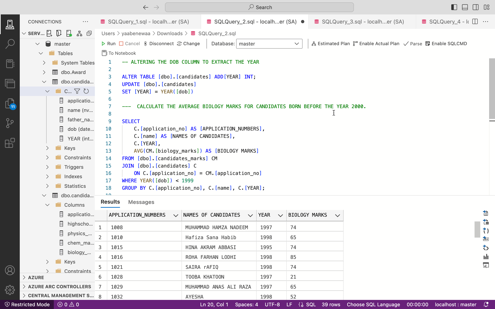
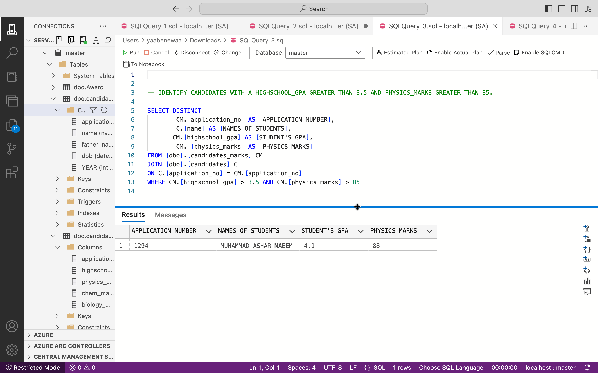
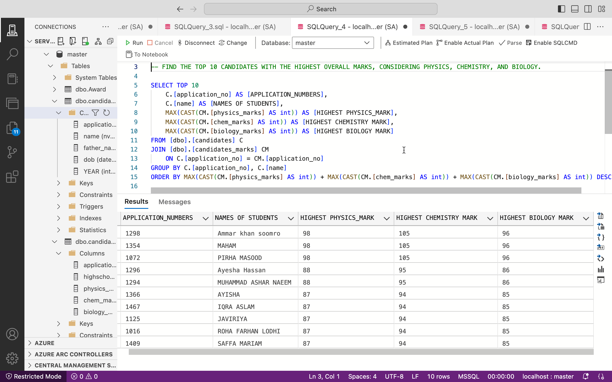
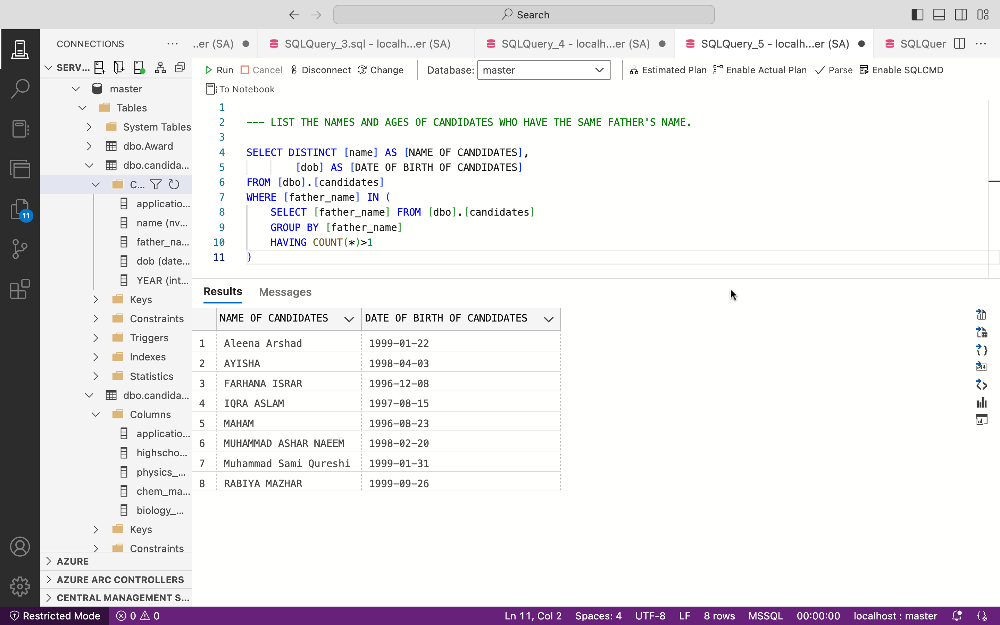
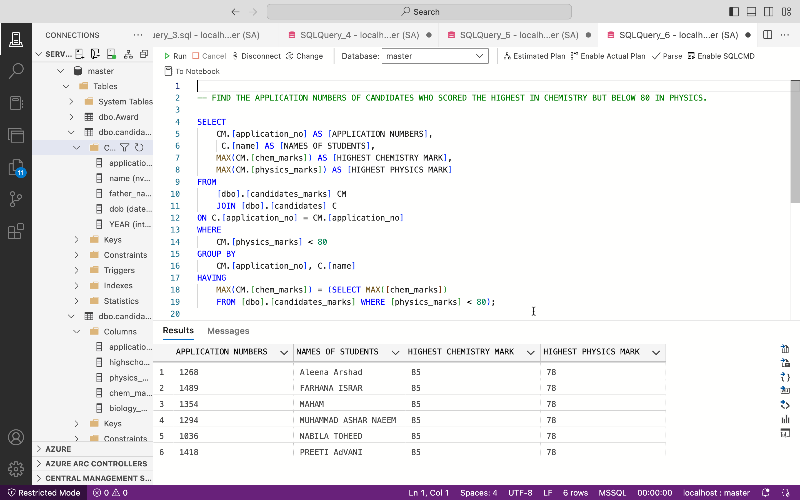
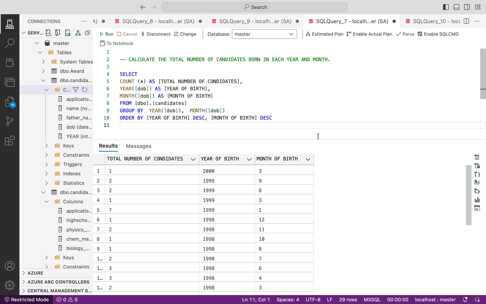
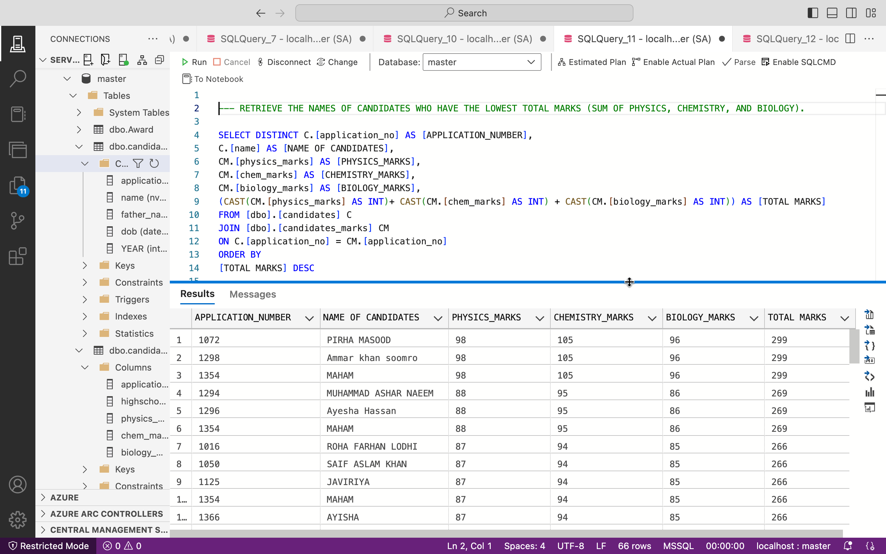
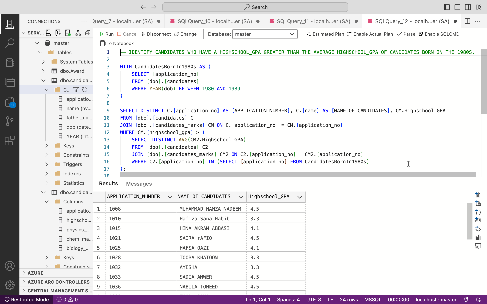
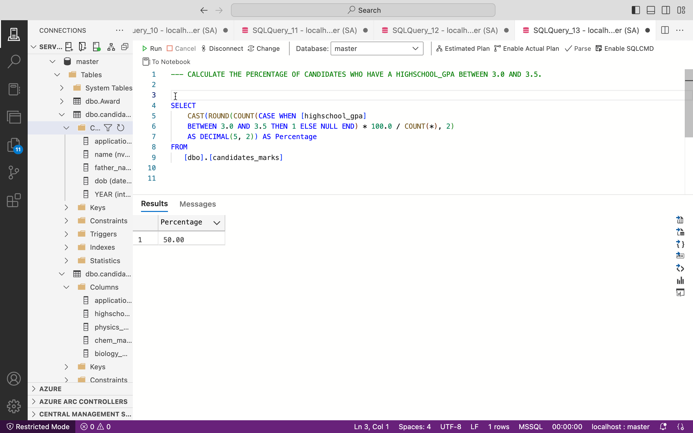

Dataset Description:

The dataset comprises two tables: Candidates_marks and Candidate. The former includes academic performance attributes like Application_no, Highschool_GPA, Physics_marks, Chem_marks, and Biology_marks. The latter holds personal details such as application_no, name, father_name, and dob. 

Insights to be gained

This dataset provides a comprehensive view of candidates' academic achievements and personal information, enabling in-depth analysis and insights that are crucial for informed decision-making in education and recruitment processes.

QUESTION TO LEAD TO THE INSIGHTS

1. Retrieve the names and application numbers of candidates who scored above 90 in both Physics and Chemistry.
2. Calculate the average Biology marks for candidates born before the year 2000.
3. Identify candidates with a Highschool_GPA greater than 3.5 and Physics_marks greater than 85.
4. Find the top 10 candidates with the highest overall marks, considering Physics, Chemistry, and Biology.
5. List the names and ages of candidates who have the same father's name.
6. Calculate the percentage of candidates who scored below the average Highschool_GPA.
7. Find the application numbers of candidates who scored the highest in Chemistry but below 80 in Physics.
8. Retrieve the names of candidates who have Biology_marks greater than the average for candidates born in the 1990s.
9. Identify candidates who have the same date of birth but different names.
10. List the application numbers of candidates who have the highest Highschool_GPA in each father's name group.
11. Calculate the total number of candidates born in each year and month.
12. Find candidates who have the same Physics_marks and Biology_marks but different Chemistry_marks.
13. Retrieve the names of candidates who have the lowest total marks (sum of Physics, Chemistry, and Biology).
14. Identify candidates who have a Highschool_GPA greater than the average Highschool_GPA of candidates born in the 1980s.
15. List the application numbers and names of candidates who have the second-highest Biology_marks.

QUESTION 1:

RETRIEVE THE NAMES AND APPLICATION NUMBERS OF CANDIDATES WHO SCORED ABOVE 90 IN BOTH PHYSICS AND CHEMISTRY.

Identifying candidates with scores above 90 in Physics and Chemistry reveals high-achievers, potentially guiding targeted academic support and recognizing exceptional talent in the application pool.

CODE

SELECT DISTINCT C.[application_no] AS [APPLICATION_NUMBERS], C.[name] AS [NAMES OF CANDIDATES]
FROM [dbo].[candidates] C JOIN [dbo].[candidates_marks] CM  ON C.[application_no] = CM.[application_no] WHERE [chem_marks] > 90 AND [physics_marks] > 90

OUTPUT 

QUESTION 2:

CALCULATE THE AVERAGE BIOLOGY MARKS FOR CANDIDATES BORN BEFORE THE YEAR 2000.

Identifying the average Biology marks for candidates born pre-2000 reveals performance trends among an older cohort.

CODE

ALTERING THE DOB COLUMN TO EXTRACT THE YEAR 

ALTER TABLE [dbo].[candidates] ADD[YEAR] INT;
UPDATE [dbo].[candidates]
SET [YEAR] = YEAR([dob])

SELECT  C.[application_no] AS [APPLICATION_NUMBERS],C.[name] AS [NAMES OF CANDIDATES],        C.[YEAR], AVG(CM.[biology_marks]) AS [BIOLOGY MARKS] FROM [dbo].[candidates_marks] CM
JOIN [dbo].[candidates] C ON C.[application_no] = CM.[application_no]
WHERE YEAR([dob]) < 1999 GROUP BY C.[application_no], C.[name], C.[YEAR];

OUTPUT 

QUESTION 3:

IDENTIFY CANDIDATES WITH A HIGHSCHOOL_GPA GREATER THAN 3.5 AND PHYSICS_MARKS GREATER THAN 85.

Identifying the average Biology marks for candidates born pre-2000 reveals performance trends among an older cohort.

CODE

SELECT DISTINCT CM.[application_no] AS [APPLICATION NUMBER], C.[name] AS [NAMES OF STUDENTS], CM.[highschool_gpa] AS [STUDENT'S GPA],CM. [physics_marks] AS [PHYSICS MARKS]
FROM [dbo].[candidates_marks] CM JOIN [dbo].[candidates] C ON C.[application_no] = CM.[application_no] WHERE CM.[highschool_gpa] > 3.5 AND CM.[physics_marks] > 85

OUTPUT 

QUESTION 4:

FIND THE TOP 10 CANDIDATES WITH THE HIGHEST OVERALL MARKS, CONSIDERING PHYSICS, CHEMISTRY, AND BIOLOGY.

Identifying the top 10 candidates with the highest marks in Physics, Chemistry, and Biology combined reveals exceptional academic performers.

CODE

SELECT TOP 10 C.[application_no] AS [APPLICATION_NUMBERS], C.[name] AS [NAMES OF STUDENTS],
MAX(CAST(CM.[physics_marks] AS int)) AS [HIGHEST PHYSICS_MARK],MAX(CAST(CM.[chem_marks] AS int)) AS [HIGHEST CHEMISTRY MARK],MAX(CAST(CM.[biology_marks] AS int)) AS [HIGHEST BIOLOGY MARK] FROM [dbo].[candidates] C JOIN [dbo].[candidates_marks] CM ON C.[application_no] = CM.[application_no] GROUP BY C.[application_no], C.[name] ORDER BY MAX(CAST(CM.[physics_marks] AS int)) + MAX(CAST(CM.[chem_marks] AS int)) + MAX(CAST(CM.[biology_marks] AS int)) DESC;

OUTPUT 

QUESTION 5:

LIST THE NAMES AND AGES OF CANDIDATES WHO HAVE THE SAME FATHER'S NAME.

Listing names and ages of candidates sharing the same father's name unveils family relationships and potential generational trends.

CODE

SELECT DISTINCT [name] AS [NAME OF CANDIDATES],[dob] AS [DATE OF BIRTH OF CANDIDATES]
FROM [dbo].[candidates] WHERE [father_name] IN (SELECT [father_name] FROM [dbo].[candidates]
GROUP BY [father_name] HAVING COUNT(*)>1)

OUTPUT 

QUESTION 6:

FIND THE APPLICATION NUMBERS OF CANDIDATES WHO SCORED THE HIGHEST IN CHEMISTRY BUT BELOW 80 IN PHYSICS.

CODE

SELECT CM.[application_no] AS [APPLICATION NUMBERS], C.[name] AS [NAMES OF STUDENTS],
MAX(CM.[chem_marks]) AS [HIGHEST CHEMISTRY MARK], MAX(CM.[physics_marks]) AS [HIGHEST PHYSICS MARK] FROM [dbo].[candidates_marks] CM JOIN [dbo].[candidates] C
ON C.[application_no] = CM.[application_no] WHERE CM.[physics_marks] < 80
GROUP BY CM.[application_no], C.[name] HAVING MAX(CM.[chem_marks]) = (SELECT MAX([chem_marks]) FROM [dbo].[candidates_marks] WHERE [physics_marks] < 80);

OUTPUT 

QUESTION 7:

CALCULATE THE TOTAL NUMBER OF CANDIDATES BORN IN EACH YEAR AND MONTH.

Calculating the total candidates born each year and month provides insights into enrollment patterns, aiding in resource allocation and planning.

CODE

SELECT COUNT (*) AS [TOTAL NUMBER OF CONDIDATES],YEAR([dob]) AS [YEAR OF BIRTH], 
MONTH([dob]) AS [MONTH OF BIRTH] FROM [dbo].[candidates] GROUP BY  YEAR([dob]), MONTH([dob]) ORDER BY [YEAR OF BIRTH] DESC, [MONTH OF BIRTH] DESC

OUTPUT 

QUESTION 8:

RETRIEVE THE NAMES OF CANDIDATES WHO HAVE BIOLOGY_MARKS GREATER THAN THE AVERAGE FOR CANDIDATES BORN IN THE 1990s.

Retrieving names of candidates with Biology_marks above the average for those born in the 1990s highlights exceptional performance within a specific age group.

CODE

SELECT C.[name] AS [NAME OF CANDIDATES],CM.[biology_marks] AS [BIOLOGY MARKS], AVG(CM.[biology_marks]) AS [AVERAGE BIOLOGY MARKS FOR 1990s] FROM [dbo].[candidates] C 
JOIN [dbo].[candidates_marks] CM ON C.[application_no] = CM.[application_no] 
WHERE YEAR(C.[dob]) BETWEEN 1990 AND 1999 GROUP BY C.[name], CM.[biology_marks]HAVING CM.[biology_marks] > AVG(CM.[biology_marks]);

OUTPUT 

QUESTION 9:

 
IDENTIFY CANDIDATES WHO HAVE THE SAME DATE OF BIRTH BUT DIFFERENT NAMES.

Identifying candidates with the same date of birth but different names unveils potential data inconsistencies or multiple entries for a single individual.

CODE

SELECT [dob] AS [DATE OF BIRTH],COUNT([application_no]) AS [NUMBER OF CANDIDATES], STRING_AGG([name], ', ') AS [NAMES OF CANDIDATES]
FROM [dbo].[candidates] GROUP BY [dob] HAVING COUNT(DISTINCT [name]) > 1;

OUTPUT 

QUESTION 10:
 
FIND CANDIDATES WHO HAVE THE SAME PHYSICS_MARKS AND BIOLOGY_MARKS BUT DIFFERENT CHEMISTRY_MARKS.

Identifying candidates with matching Physics_marks and Biology_marks but different Chemistry_marks reveals unique academic profiles and potential subject-specific strengths or weaknesses.

CODE

SELECT DISTINCT C.[name] AS [NAME OF CANDIDATES], C.[application_no] AS [APPLICATION NUMBER], CM.[physics_marks] AS [PHYSICS_MARKS], CM.[chem_marks] AS [CHEMISTRY_MARKS],
CM.[biology_marks] AS [BIOLOGY_MARKS] FROM [dbo].[candidates] C JOIN [dbo].[candidates_marks] CM ON C.[application_no] = CM.[application_no]
WHERE CM.[physics_marks] =CM.[physics_marks] AND CM.[biology_marks]=  CM.[biology_marks]
AND CM.[chem_marks] <> CM.[chem_marks] AND C.[application_no] <> CM.[application_no]

OUTPUT 

QUESTION 11:

RETRIEVE THE NAMES OF CANDIDATES WHO HAVE THE LOWEST TOTAL MARKS (SUM OF PHYSICS, CHEMISTRY, AND BIOLOGY).

Retrieving names of candidates with the lowest total marks in Physics, Chemistry, and Biology highlights those needing additional academic support or intervention.

CODE

SELECT DISTINCT C.[application_no] AS [APPLICATION_NUMBER], C.[name] AS [NAME OF CANDIDATES],
CM.[physics_marks] AS [PHYSICS_MARKS], CM.[chem_marks] AS [CHEMISTRY_MARKS], CM.[biology_marks] AS [BIOLOGY_MARKS], (CAST(CM.[physics_marks] AS INT)+ CAST(CM.[chem_marks] AS INT) + CAST(CM.[biology_marks] AS INT)) AS [TOTAL MARKS] FROM [dbo].[candidates] C  JOIN [dbo].[candidates_marks] CM ON C.[application_no] = CM.[application_no] ORDER BY [TOTAL MARKS] DESC

OUTPUT 

QUESTION 12:

IDENTIFY CANDIDATES WHO HAVE A HIGHSCHOOL_GPA GREATER THAN THE AVERAGE HIGHSCHOOL_GPA OF CANDIDATES BORN IN THE 1980S.

Identifying candidates with a Highschool_GPA surpassing the average for those born in the 1980s reveals outstanding academic performance within that specific age group.

CODE

WITH CandidatesBornIn1980s AS (SELECT [application_no] FROM [dbo].[candidates]
WHERE YEAR(dob) BETWEEN 1980 AND 1989)
SELECT DISTINCT C.[application_no] AS [APPLICATION_NUMBER], C.[name] AS [NAME OF CANDIDATES], CM.Highschool_GPA FROM [dbo].[candidates] C JOIN [dbo].[candidates_marks] CM ON C.[application_no] = CM.[application_no] WHERE CM.[highschool_gpa] > (SELECT DISTINCT AVG(CM2.Highschool_GPA) FROM [dbo].[candidates] C2 JOIN [dbo].[candidates_marks] CM2 ON C2.[application_no] = CM2.[application_no] WHERE C2.[application_no] IN (SELECT [application_no] FROM CandidatesBornIn1980s));

OUTPUT 

QUESTION 13:

CALCULATE THE PERCENTAGE OF CANDIDATES WHO HAVE A HIGHSCHOOL_GPA BETWEEN 3.0 AND 3.5.

Calculating the percentage of candidates with Highschool_GPA between 3.0 and 3.5 highlights the prevalence of moderate academic performance within the dataset.

CODE

SELECT CAST(ROUND(COUNT(CASE WHEN [highschool_gpa] BETWEEN 3.0 AND 3.5 THEN 1 ELSE NULL END) * 100.0 / COUNT(*), 2) AS DECIMAL(5, 2)) AS Percentage
FROM  [dbo].[candidates_marks]

OUTPUT 

